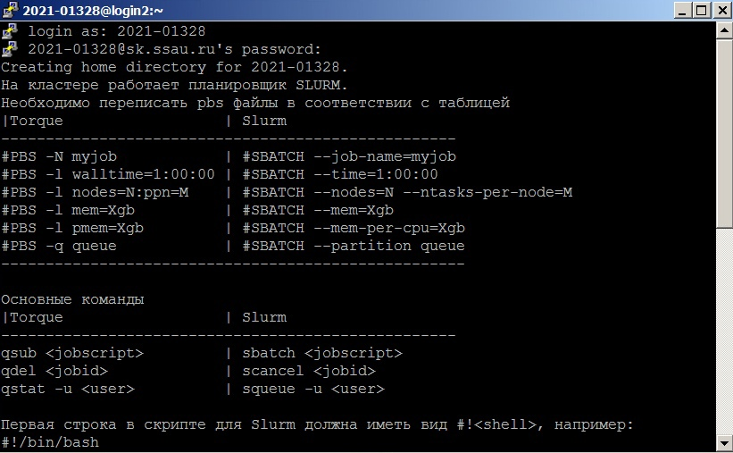
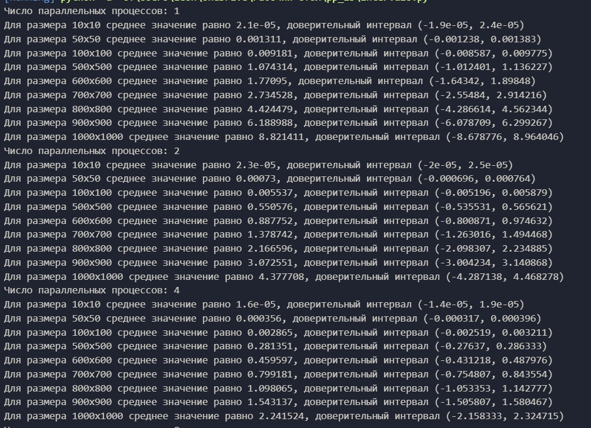
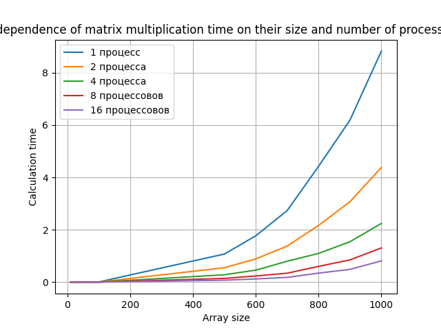

# Описание к лабораторным работам
### Лабораторная 3
***Выполнил студент группы 6312-100503D Пахомов Леонид***
___

### Условия проведения эксперементов

- [X] Стандарт ISO C++ 11 (/std:c++11)
- [X] Суперкомпьютер Королев

### Задание на *л/р*:

- [X] Написать на С++ программу, будет выполняться параллельно, исспользуя MPI
- [X] Написать программу на Python, которая проверяет результат перемножений матриц на C++, вычисляет доверительные интервалы
- [X] Получить графики зависимости времени вычислений от размеров матриц с использованием параллельных вычислений и сравнить

### Ход работы
+ Написал на с++ программу, которая будет перемножать матрицы и выводить результат и время работы. Для статистики для каждой размерности матрицы результаты считаются 10 раз
+ Подключился к суперкомпьютеру Королев, необходимые данные взял из лк, необходимые программы скачал по туториалу с лекции
### Консоль с подключением

+ После компиляции и выполнения скриптов забрал итоговые файлы и сделал по ним статистику
### Статистика результатов

+ С помощью полученных данных построил графики
### График зависимостей:

:octocat: Результаты:

В лабораторной работе были произведены 10 перемножений матриц разных размеров с использованием параллельных вычислений MPI. С помощью скриптов были высчитаны доверительные интервалы для каждых 10-ти произведений, а так же средние значения времени вычислений. По результатам (особенно визуально, на графике) видно, что при увеличении количества процессов, время, затраченное на перемножение матриц, существенно уменьшается.